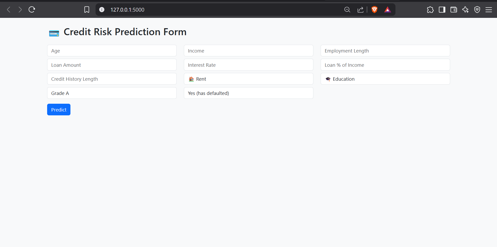

# 💳 Credit Risk Prediction System

A production-ready machine learning pipeline to predict the likelihood of loan default. This project leverages advanced feature engineering, model optimization (Logistic Regression & XGBoost), and a Flask-based web application to enable real-time credit risk assessment.

---

## 📘 Overview

Accurately predicting loan defaults is crucial for risk mitigation in financial institutions. This system is built to process applicant information, engineer meaningful features, and generate real-time predictions via a simple web interface.

Key Components:
- Cleaned & engineered dataset
- Baseline and tuned ML models
- Web app for prediction
- Feature importance insights

---

## 🧾 Dataset Description

The dataset includes loan applicants' demographic, financial, and credit-related attributes.

| Feature | Description |
|---------|-------------|
| `person_age` | Age of the applicant |
| `person_income` | Annual income |
| `person_home_ownership` | Type of home ownership (RENT, OWN, etc.) |
| `person_emp_length` | Employment length in years |
| `loan_amnt` | Loan amount requested |
| `loan_int_rate` | Interest rate on the loan |
| `loan_intent` | Purpose of the loan (EDUCATION, VENTURE, etc.) |
| `loan_grade` | Assigned loan grade (A to G) |
| `loan_percent_income` | Loan amount as % of income |
| `cb_person_default_on_file` | Has previously defaulted (Y/N) |
| `cb_person_cred_hist_length` | Credit history length |
| `loan_status` | Target variable (0 = No Default, 1 = Default) |

Additional feature engineered:
- `debt_to_income_ratio` = `loan_amnt` / `person_income`

---

## 🛠️ ML Pipeline Summary

1. **Exploratory Data Analysis (EDA)**
   - Null values handled
   - Distribution and correlation analysis
   - Outlier handling

2. **Feature Engineering**
   - Derived `debt_to_income_ratio`
   - One-hot encoded all categorical features

3. **Model Training**
   - Logistic Regression (with scaling)
   - XGBoost (with GridSearchCV tuning)
   - Evaluation: ROC-AUC, Classification Report

4. **Feature Importance**
   - Top features extracted using `model.feature_importances_`

5. **Flask Deployment**
   - Input form for applicant data
   - Model inference in real time
   - Prediction: "Approved" or "Rejected" + default probability

---

## 🚀 Quick Start

### ✅ Clone the Repo
```bash
git clone https://github.com/your-username/credit-risk-prediction.git
cd credit-risk-prediction
```

### ✅ Install Requirements
```bash
pip install -r requirements.txt
```

### ✅ Run Flask App
```bash
cd app
python app.py
```

Then navigate to:
```
http://127.0.0.1:5000
```

---

## 📸 Screenshot

```

```

---

## 📁 Directory Structure

```
credit-risk-prediction/
├── app/
│   ├── app.py
│   ├── model/final_xgb_model.pkl
│   └── templates/index.html
├── data/               # Raw and cleaned datasets
├── models/             # Model artifacts
├── notebooks/          # EDA, modeling, explainability
├── reports/            # Feature plots, performance metrics
└── README.md
```

---

## 📬 Contact

**Author**: [Nitin Kandpal](https://www.linkedin.com/in/nitinkandpal)    
**Email**: [nkbusiness17@gmail.com]

---

## ✅ Status

✅ EDA  
✅ Feature Engineering  
✅ Model Training  
✅ Flask Deployment  
🟢 Demo Recording (Optional)  
🟢 Optional: Cloud Deployment (Heroku / Render)

---

## 🏁 Final Notes

This project demonstrates an end-to-end applied machine learning pipeline with real-world relevance, built for production-readiness and interpretability.

---

